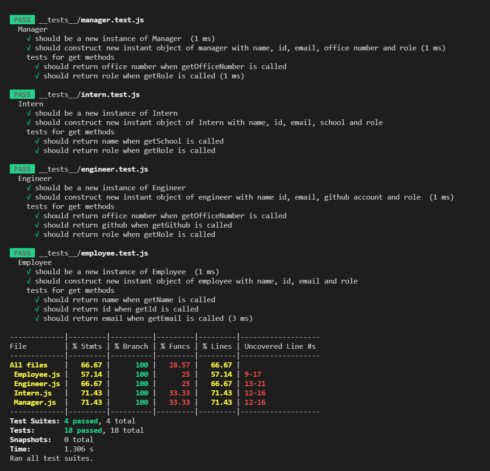

# team-generator


## Table of Contents

- [team-generator](#team-generator)
  - [Table of Contents](#table-of-contents)
  - [Description](#description)
  - [Installation](#installation)
  - [Usage](#usage)
  - [License](#license)
  - [Contributing](#contributing)
  - [Tests](#tests)

## Description

I've been tasked with making a Team generator.
which uses inquirer to prompt for the questions.
which uses jest for testing.

## Installation

```
git clone git@github.com:Cratesy/team-generator.git
cd team-generator
npm install
```

## Usage

When run, a user is prompted with questions, the user has to fill out answers which are stored.
Doing this generates a html file which uses information from the questions answered.
It populates the team name, and cards for each employee.

## License

[MIT License](https://opensource.org/licenses/MIT)

## Contributing

[Mike](https://github.com/Cratesy)

## Tests


